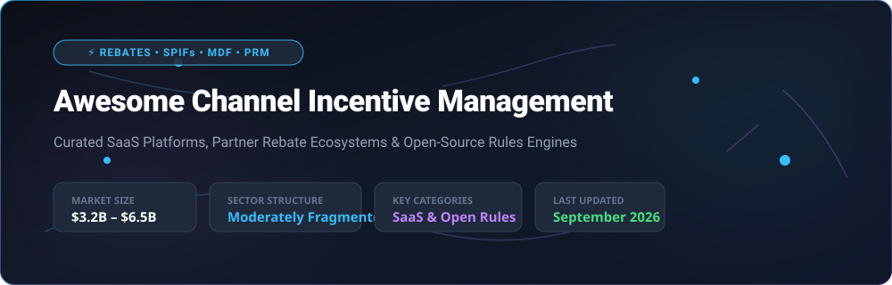

# 🚀 Awesome Channel Incentive Management (CIM) & Partner Rebate Ecosystem

  

A curated directory of top **SaaS platforms**, **Partner Relationship Management (PRM) software**, and **open-source rules engines** for **Channel Incentive Management (CIM)**. These solutions automate partner rebates, SPIFs (Sales Performance Incentive Funds), MDF (Market Development Funds) / co-op budgeting, channel rewards, payout fulfillment, and indirect revenue motivation programs.

---

## 📊 Market Overview & Industry Dynamics

> 💡 **Market Size:** The global **Channel Incentive Management (CIM)** and **Partner Relationship Management (PRM)** software market is estimated at **$3.2 Billion in 2026** and is projected to expand to **$6.5 Billion by 2030** (CAGR of ~15.2%).  
> 📌 **Market Fragmentation:** The sector is **moderately fragmented**. Enterprise mega-vendors (*Salesforce, Model N, Vistex*) dominate complex global rebate accounting and compliance, while agile specialists (*Enable, PartnerStack, 360insights, Voucherify*) capture fast-growing cloud PRM, promotional engine, and partner payout segments.

---

## 💼 SaaS & Hosted Channel Incentive Platforms

The table below lists leading SaaS solutions for managing channel rebates, SPIFs, MDF/co-op programs, and partner payout fulfillment, sorted by **Company Size / Revenue / Valuation (Descending)**:

| Platform Name | Description | Company Size / Revenue / Valuation | Pricing Tier | Free Tier / Trial Limits |
| :--- | :--- | :--- | :--- | :--- |
| **[Salesforce Rebate Management](https://www.salesforce.com/)** | Enterprise rebate & incentive management suite integrated into Salesforce Revenue Cloud. | ~$34.9B Revenue ($250B+ Market Cap) | Starts at $400/user/month (Rebate Management add-on) | 30-day free trial of Salesforce CRM environment |
| **[Blackhawk Network](https://blackhawknetwork.com/)** | Global corporate incentives, partner motivation, and prepaid reward fulfillment platform. | ~$1.5B Revenue ($3.5B Valuation) | Starts at ~$10,000/year base + reward card load fees (1-3%) | Guided enterprise demo; test API sandbox available on request |
| **[Model N](https://www.modeln.com/)** | Revenue and channel management platform providing enterprise rebate execution and compliance. | ~$250M ARR ($1.25B Valuation) | Enterprise software starting at ~$50,000/year base platform | Guided interactive sandbox demo; no self-serve free trial |
| **[Vistex](https://www.vistex.com/)** | Enterprise go-to-market software covering partner incentives, rebates, and channel payouts. | ~$250M ARR (~$1.0B Valuation) | Enterprise contracts starting at ~$40,000/year base | Custom guided demo; developer test portal available on request |
| **[Xactly Incent](https://www.xactly.com/)** | Incentive compensation and sales commission platform applied to indirect channel partner structures. | ~$200M ARR (~$564M Valuation) | Starts at $60/user/month (Xactly Express tier) | 14-day free trial for Xactly Express tier |
| **[360insights](https://www.360insights.com/)** | Channel incentives platform for rebates, SPIFs, MDF/co-op, and automated partner payouts. | ~$100M ARR (~$400M Valuation) | Custom enterprise contracts starting at ~$25,000/year | Guided proof-of-concept (POC) sandbox on request |
| **[Enable](https://www.enable.com/)** | Channel incentive and rebate management platform for B2B rebate deal calculation and claim validation. | ~$50M ARR ($1.0B+ Valuation) | Starts at $1,000/month ($12,000/year base platform) | 14-day free trial available for Enable Rebate Management |
| **[Impartner](https://www.impartner.com/)** | Partner Relationship Management (PRM) suite with integrated MDF, co-op, and channel incentive tools. | ~$50M ARR (~$250M Valuation) | Starts at $2,000/month for base PRM & incentive suite | Guided live sandbox demo; no self-serve free trial |
| **[Pricefx](https://www.pricefx.com/)** | Modular cloud pricing and rebate management platform for B2B channel incentive optimization. | ~$40M ARR (~$200M Valuation) | Starts at $3,500/month for base pricing & rebate module | 30-day interactive sandbox trial on request |
| **[PartnerStack](https://www.partnerstack.com/)** | Partner ecosystem and B2B SaaS affiliate/referral platform with automated incentive payouts. | ~$30M ARR (~$300M Valuation) | Starts at $500/month (Essentials tier) | 14-day free trial on Essentials & Growth plans |
| **[Tango Card](https://www.tangocard.com/)** | Digital reward catalog and incentive payout API for partner, customer, and employee recognition. | ~$30M ARR (~$150M Valuation) | $0/month platform fee (pay-per-reward face value + nominal processing fees) | Free account setup with zero monthly minimums |
| **[Zift Solutions](https://www.ziftsolutions.com/)** | Enterprise ZiftONE channel marketing and partner enablement platform with program incentives. | ~$25M ARR (~$120M Valuation) | Starts at $1,500/month for ZiftONE platform | 30-day guided sandbox access on request |
| **[Talon.One](https://www.talon.one/)** | API-first promotion and loyalty engine to define custom partner incentive rules, tiers, and rewards. | ~$20M ARR (~$150M Valuation) | Starts at $1,490/month (Developer/Startup tier) | 14-day free trial with full API access |
| **[Extu](https://www.extu.com/)** | Channel marketing and partner motivation platform executing B2B incentive programs. | ~$20M ARR (~$100M Valuation) | Enterprise programs starting at ~$10,000/year | Custom interactive demo; test environment provided on request |
| **[Channel Mechanics](https://www.channelmechanics.com/)** | Channel incentive and partner program automation software for vendor promotions and tier management. | ~$15M ARR (~$75M Valuation) | Enterprise program plans starting at ~$15,000/year | Guided live demonstration; no self-serve free trial |
| **[Voucherify](https://www.voucherify.io/)** | API-first promotional engine powering coupons, referral rewards, loyalty points, and channel incentives. | ~$10M ARR (~$50M Valuation) | Starts at $300/month (Growth tier) | Free Tier: $0/mo (1,000 API calls/mo & 100 redemptions/mo); 30-day trial for paid features |

---

## 🔓 Open-Source GitHub Projects & Rules Engines

While enterprise channel rebate management is predominantly commercial, open-source rules engines, headless commerce engines, and referral frameworks provide building blocks for custom incentive systems. Sorted by **GitHub Stars_Count (Descending)**:

| Project Name | GitHub_Stars | Description | Use Case in Channel Incentives |
| :--- | :--- | :--- | :--- |
| **[Medusa](https://github.com/medusajs/medusa)** |  | Open-source headless commerce and promotion platform supporting custom discount logic, coupons, and partner reward mechanisms. | Custom partner portal promotion backends and reward checkout modules. |
| **[Hyperledger Fabric](https://github.com/hyperledger/fabric)** |  | Enterprise permissioned distributed ledger framework for multi-party agreement tracking and claim validation. | Immutable B2B rebate settlement, multi-tier partner claim auditing, and payout verification. |
| **[Apache KIE / Drools](https://github.com/apache/incubator-kie)** |  | Enterprise business rules engine (BRMS) and complex event processing framework. | Executing complex partner eligibility criteria, multi-tiered rebate calculation formulas, and SPIF qualification matrix. |
| **[Easy Rules](https://github.com/j-easy/easy-rules)** |  | Lightweight Java rules engine expressed as simple annotations and declarative rules. | Embedding partner qualification rules and tier commission logic into custom Java incentive systems. |
| **[JSON Rules Engine](https://github.com/CacheControl/json-rules-engine)** |  | Rules engine expressed in JSON for declarative validation of business conditions. | Validating partner claim submissions, MDF eligibility conditions, and reward trigger rules. |
| **[GoRules Zen Engine](https://github.com/gorules/zen)** |  | High-performance cross-language Business Rules Engine (Rust/Node/Go/Python/Java) supporting decision tables. | High-speed evaluation of partner rebate matrices and multi-currency payout rules. |
| **[RuleGo](https://github.com/rulego/rulego)** |  | Lightweight component orchestration rule engine framework for Go. | Event-driven claim submission workflows, automated approval routing, and notification chains. |
| **[Durable Rules](https://github.com/jruizgit/rules)** |  | Polyglot rule engine for real-time complex event processing (CEP) and pattern matching. | Processing high-frequency channel sales events and instant SPIF trigger notifications. |
| **[VoucherVault](https://github.com/l4rm4nd/VoucherVault)** |  | Django web application to store and manage vouchers, coupons, loyalty tokens, and digital gift cards. | Self-hosted reward catalog, digital coupon distribution, and partner payout tracking. |
| **[RefRef](https://github.com/amicalhq/refref)** |  | Open-source referral and affiliate marketing platform to track referrals and commission structures. | Partner referral tracking, commission tier calculation, and affiliate reward payout automation. |

---

## 🏗️ Building Custom Channel Incentive Workflows

When implementing a custom internal channel incentive stack:

1. **Rule Logic Definition**: Use a declarative business rules engine (*GoRules Zen, Apache Drools, or JSON Rules Engine*) to isolate partner rebate formulas from application code.
2. **Claim Portal & Ingestion**: Build lightweight claim intake forms using modern frontend stacks connected to audit-ready databases.
3. **Payout Execution**: Integrate digital reward APIs (*Tango Card, Voucherify*) or ERP payment rails for automated settlement upon approval.
4. **Enterprise Scale & Compliance**: For global programs with complex tax, multi-currency rebate accounting, and audit compliance requirements, commercial enterprise CIM platforms (*360insights, Enable, Model N, Vistex*) remain the standard recommendation.

---

## 🤝 How to Contribute

Contributions are welcome and greatly appreciated! 

1. 🍴 **Fork the repository**
2. 📝 **Add/Update entries** in `README.md` using the Markdown table structure above
3. 🔍 **Provide accurate metadata**: Official product URL, specific pricing tier, free tier limits, company size estimate, or GitHub Stars_Counts
4. 🚀 **Open a Pull Request** with a clear title and description

---

## 💖 Support & Community

If you found this repository useful, please consider supporting the project:

- ⭐ **Star this repository** to help others discover it!
- 🍴 **Fork & Share** with your channel operations and partner management networks.
- 💬 **Join our community** on [Discord](https://discord.gg/jc4xtF58Ve)!
- ☕ **Sponsor / Buy me a coffee**: Support ongoing open-source curation on [GitHub Sponsors](https://github.com/sponsors/ishandutta2007).

---

## 📈 Star History

---

## ⚠️ Disclaimer

- This list is **community-curated** for informational purposes and does not constitute endorsement.
- Channel incentives involve legal contracts, financial settlement, tax compliance, and auditing. Always consult qualified legal and financial professionals when implementing commercial incentive programs.

---

<b>Made with ❤️ for Channel Managers, PRM Operations Teams, and Open Incentive Advocates.</b>

